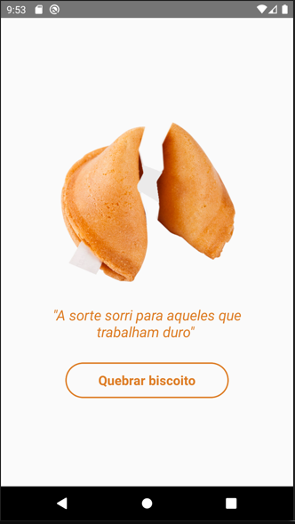

# Quebrando o Biscoito da Sorte

## Descrição
O "Quebrando o Biscoito da Sorte" é um aplicativo móvel simples desenvolvido em React Native que simula a experiência de quebrar um biscoito da sorte virtual. Quando os usuários tocam no botão "Quebrar biscoito", o aplicativo exibe uma mensagem inspiradora aleatória juntamente com uma imagem do biscoito da sorte aberto. O objetivo é proporcionar mensagens motivacionais e enigmáticas de forma divertida e interativa.

## Recursos Principais
- **Biscoito da Sorte Virtual:** Interface com a imagem de um biscoito da sorte fechado.

- **Quebrar o Biscoito:** Os usuários podem tocar no botão "Quebrar biscoito" para gerar mensagens inspiradoras aleatórias.

- **Exibição da Mensagem:** A mensagem é exibida na tela junto com a imagem do biscoito da sorte aberto.

- **Estilo Personalizado:** A interface utiliza estilos CSS personalizados para uma experiência visual atraente.

- **Interação Simples:** Os usuários podem quebrar o biscoito quantas vezes desejarem para receber novas mensagens inspiradoras.

## Pré-requisitos
- Node.js e NPM instalados.
- Ambiente de desenvolvimento React Native configurado.

## Como Usar
1. Clone o repositório.
2. Execute `npm install` para instalar as dependências.
3. Execute `npm start` para iniciar o aplicativo.
4. Teste o aplicativo em um emulador ou dispositivo físico.

## Contribuição
Contribuições são bem-vindas! Sinta-se à vontade para abrir problemas (issues) e enviar pull requests.

## Licença
Este projeto está licenciado sob a Licença MIT. Consulte o arquivo [LICENSE](LICENSE) para obter detalhes.

---

Divirta-se quebrando os biscoitos da sorte e recebendo mensagens inspiradoras!

  

